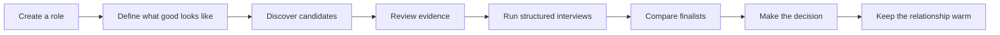
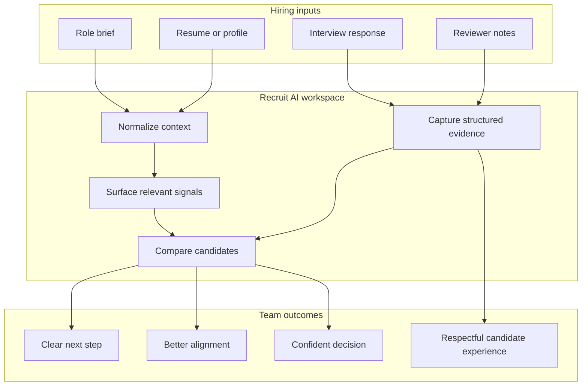
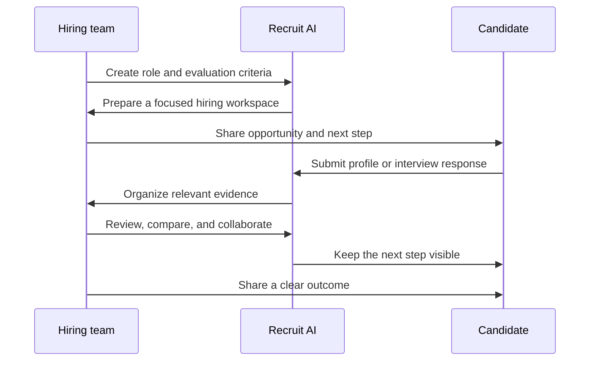

# Recruit AI

### A calmer, faster way to make better hiring decisions.

Recruit AI is an open-source recruitment workspace for teams that want to move from scattered resumes and disconnected conversations to a clear, evidence-led hiring process.

It brings sourcing, job intake, candidate review, structured evaluation, outreach, interview workflows, and decision-making into one focused experience—so hiring teams can spend less time managing the process and more time meeting the right people.

<p align="center">
  <a href="https://github.com/Recruit-ai-labs/recruit-ai-labs-">View on GitHub</a>
  ·
  <a href="#getting-started">Get started</a>
  ·
  <a href="#contributing">Contribute</a>
</p>

## Product preview

<p align="center">
  <video autoplay loop muted playsinline controls width="900" preload="metadata">
    <source src="./public/WhatsApp%20Video%202026-09-23%20at%2012.24.06.original.mp4" type="video/mp4" />
    Your browser does not support embedded video.
  </video>
</p>

## Why Recruit AI?

Hiring gets noisy when the signal is spread across job boards, inboxes, spreadsheets, interview notes, and intuition. Recruit AI gives every candidate a structured place in the process and gives every hiring decision a clear trail of evidence.

- **One hiring workspace** — Keep jobs, candidates, evaluations, interviews, and follow-ups connected.
- **Faster candidate review** — Move from an uploaded resume to a useful candidate profile without repetitive manual work.
- **Structured decisions** — Compare candidates using consistent criteria instead of memory or guesswork.
- **Human-friendly workflows** — Keep recruiters, hiring managers, and candidates aligned at every stage.
- **Built for focused teams** — Reduce coordination overhead without turning the hiring process into a spreadsheet project.
- **Designed to grow** — Start with a simple workflow and expand into sourcing, outreach, interviews, and reporting as your team matures.

## The hiring journey



## Product areas

| Area | What it helps you do |
| --- | --- |
| **Workspace** | See what needs attention today across roles, candidates, and follow-ups. |
| **Job intake** | Turn a hiring need into a clear, reviewable role brief. |
| **Candidate pipeline** | Track candidates from first signal to final decision. |
| **Candidate intelligence** | Build a richer view of experience, strengths, risks, and role fit. |
| **Discovery** | Find and organize relevant talent without losing the context behind each profile. |
| **Interview workflows** | Create consistent interview experiences and capture useful evidence. |
| **Decision room** | Compare finalists, review signals, and align the hiring team. |
| **Outreach** | Prepare thoughtful follow-ups and keep promising conversations moving. |
| **Vetting** | Record checks, evidence, consent, and review status in one place. |
| **Analytics** | Understand activity, pipeline movement, and where the process slows down. |

## From signal to decision



## A thoughtful candidate experience

Recruiting is also a product experience. Recruit AI keeps the candidate journey clear and respectful—from the first invitation to the final follow-up.



## Getting started

### Requirements

- A recent Node.js installation
- Git
- The environment values required by the features you want to run

### Run locally

```bash
git clone https://github.com/Recruit-ai-labs/recruit-ai-labs-.git
cd recruit-ai-labs-
npm install
npm run dev
```

Open `http://localhost:3000` in your browser.

For a full local setup, copy `.env.local.example` to `.env.local` and add the values required by your environment. Never commit `.env.local` or any private credentials.

### Useful commands

```bash
npm run dev       # Start the development server
npm run build     # Create a production build
npm run start     # Start the production server
npm test          # Run the test suite
```

## Project principles

1. **Evidence over noise** — Important decisions should be grounded in useful signals.
2. **Clarity over complexity** — Every screen should make the next action easier to understand.
3. **Human judgment stays central** — The product supports hiring teams; it does not replace their responsibility.
4. **Privacy by design** — Candidate information deserves careful handling throughout the workflow.
5. **Progress over perfection** — Good hiring systems improve through feedback and iteration.

## Contributing

Contributions, ideas, bug reports, and thoughtful product feedback are welcome.

1. Fork the repository.
2. Create a branch: `git checkout -b feature/your-idea`
3. Make your change and add tests where useful.
4. Run the relevant checks locally.
5. Open a pull request with the problem, approach, and screenshots or recordings when relevant.

## License

This project is released under the MIT License.

---

Built for the people who make hiring feel more human.
